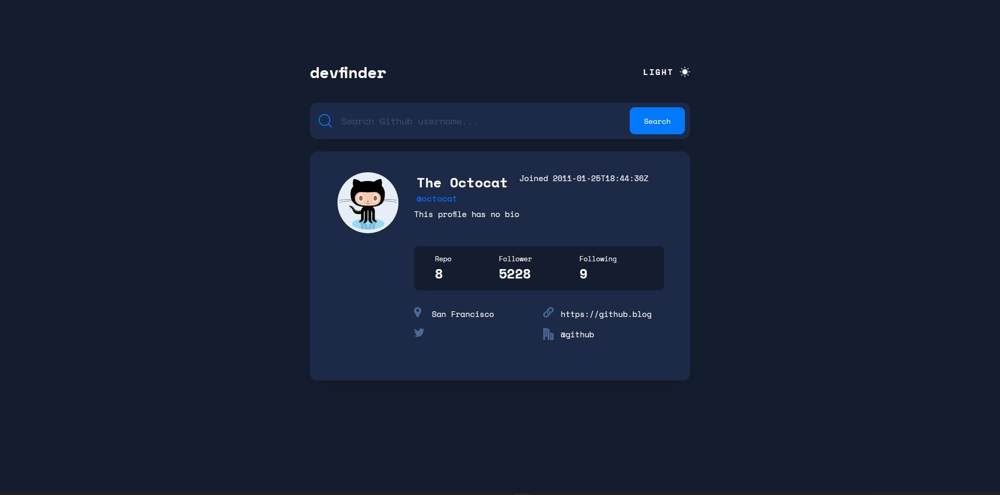

# Frontend Mentor - GitHub user search app solution

This is a solution to the [GitHub user search app challenge on Frontend Mentor](https://www.frontendmentor.io/challenges/github-user-search-app-Q09YOgaH6). Frontend Mentor challenges help you improve your coding skills by building realistic projects.

## Table of contents

- [Overview](#overview)
  - [The challenge](#the-challenge)
  - [Screenshot](#screenshot)
  - [Links](#links)
- [Built with](#built-with)
- [Author](#author)

## Overview

### The challenge

Users should be able to:

- View the optimal layout for the app depending on their device's screen size
- See hover states for all interactive elements on the page
- Search for GitHub users by their username
- See relevant user information based on their search
- Switch between light and dark themes
- Have the correct color scheme chosen for them based on their computer preferences.

### Screenshot

### Links

- Live Site URL: [https://https://inspiring-shidharthlimboo-061a9e.netlify.app/]

### Built with

- CSS
- Flexbox
- React
- Javascript
- Mobile-first workflow

## Author

- Website - [Shidharth Limboo](https://github.com/sushimushi)
